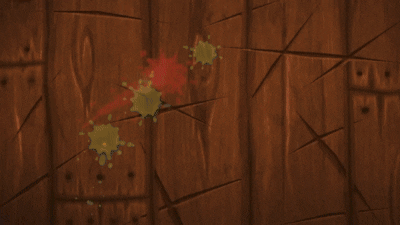

  

<h1 align="center">🍉 FruitCutter – The Classic Fruit Ninja, Reimagined</h1>

**FruitCutter** is a faithful yet imaginative remake of the iconic mobile game **Fruit Ninja**, built entirely using [Scratch](https://scratch.mit.edu). It is a **work-in-progress** game that brings slicing satisfaction to the desktop in a browser-based, visually programmed format. This project is part of my journey into **game development, visual logic, and interactive design** using the Scratch platform.

🔗 **Play the demo here**: [FruitCutter on Scratch](https://scratch.mit.edu/projects/1197626235)

---

## 🎮 What is FruitCutter?

Fruit-Cutter is a Scratch-based game where fruits spawn randomly on the screen, and the player uses the **mouse pointer as a virtual blade** to slice them. The gameplay captures the essence of Fruit Ninja – fast-paced, reflex-driven action – but with the simplicity and charm of Scratch’s block-based programming.

Though the game is still under development, it already includes **core mechanics** such as:

- Sprite cloning for multiple fruit objects  
- Randomized fruit spawning  
- Mouse-tracking slicing action  
- Scoring system  
- Game Over condition when too many fruits are missed

This game is designed with interactivity and learning in mind, emphasizing Scratch’s ability to simulate real-time gaming experiences.

---

## ✨ Features

- 🥭 **Sprite Cloning:** Multiple fruits appear on the screen using Scratch’s clone blocks, each behaving as an independent game object.
- 🍌 **Random Fruit Spawning:** Fruits are spawned at randomized positions and velocities, simulating unpredictability and excitement.
- 🖱️ **Mouse-based Slicing:** Players "cut" fruits by dragging the mouse across them. Collision detection between the cursor and fruit determines a slice.
- 📈 **Score Counter:** Every successfully sliced fruit increases the player’s score.
- 💥 **Game Over Mechanic:** Missing too many fruits results in a game over screen, encouraging focus and speed.
- 🎨 **Visual Feedback:** Exploding animations and sound effects enhance gameplay immersion (under development).

---

## 🧠 What I Learned

Developing Fruit-Cutter has been a rich learning experience. Here are some key skills and concepts I explored:

### 🔄 Game Logic and Mechanics
- Structuring gameplay loops using `forever`, `if`, and `broadcast` blocks
- Managing states such as play, score update, and game over

### 👾 Sprite Cloning and Management
- Dynamically generating multiple fruit instances with unique properties
- Handling clone deletion and memory management within Scratch

### 🎯 Collision Detection
- Implementing accurate collision between fast-moving sprites and the mouse
- Triggering slice events and visual responses

### 🎮 User Interaction
- Designing intuitive controls using mouse input
- Giving users real-time feedback through effects and sounds

### 🧪 Iterative Development
- Repeatedly testing and refining game mechanics
- Balancing spawn rate, movement, and difficulty

### 🎨 Design & UX
- Making the interface visually appealing
- Designing simple yet effective fruit assets

---

## 🛠️ Under Development / To-Do

- 🎵 Add sound effects and background music
- 💣 Add bombs and special fruits
- ⏱️ Add time-based challenge mode
- 🌟 Introduce power-ups (slow motion, double score, etc.)
- 💾 Implement high-score tracking
- 📱 Optimize layout for tablets and touchscreen devices

---

## 🖼️ Screenshots

*(Add screenshots here from the Scratch project preview once you're ready)*

---

## 📚 Technologies Used

| Technology | Purpose |
|------------|---------|
| Scratch    | Game engine, visual programming |
| Mouse Inputs | Slicing mechanic |
| Sprite Costumes | Visuals and animations |
| Cloning | Fruit spawning |

---

## 🎯 Purpose of the Project

This project helps me apply and understand:

- Game development using Scratch
- Real-time event handling
- Visual logic building
- Player experience design

It also demonstrates that simple tools like Scratch can be powerful when used creatively.

---

## 🚀 How to Play

1. Go to: [Fruit-Cutter on Scratch](https://scratch.mit.edu/projects/1197626235)
2. Click the green flag to begin
3. Move your mouse cursor over fruits to slice them
4. Don’t miss too many fruits – or it’s Game Over!
5. Try to beat your best score!

---

## 📬 Feedback

Have suggestions or ideas? Feel free to open an issue or start a discussion here on GitHub. I’d love to hear your thoughts!

---

## 🙌 Acknowledgements

Sincere thanks to:
- The Scratch team and community
- The original developers of Fruit Ninja — Halfbrick Studios, with lead designer Luke Muscat, for the inspiration.

---
